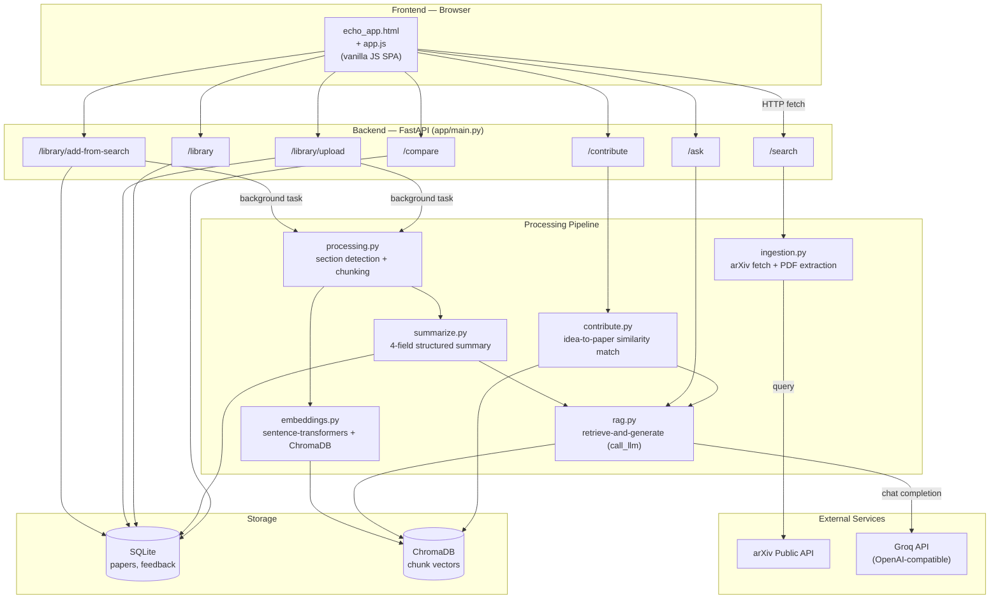
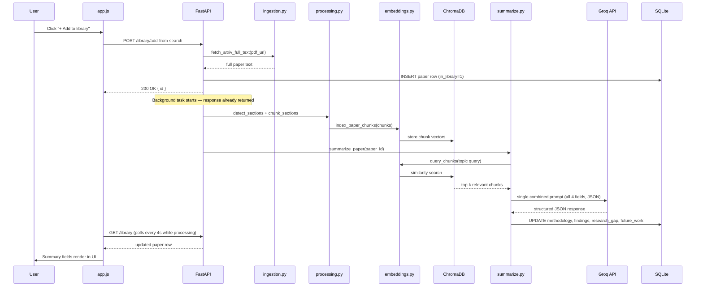
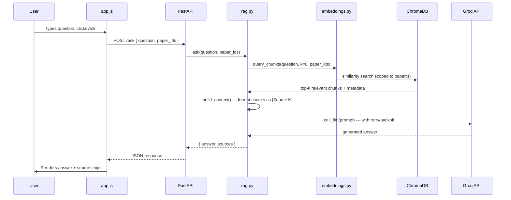

# Echo — AI Research Assistant


Echo is a local-first research assistant that helps researchers, students, and independent
learners move from **literature discovery** to **identifying where they could contribute
original work**. It combines live paper search, retrieval-augmented summarization, per-paper
Q&A, cross-paper comparison, and idea-to-literature matching in a single self-hosted tool.

Echo is not a wrapper around a single prompt — it is a full **RAG (Retrieval-Augmented
Generation) pipeline**: every paper you add is parsed, chunked, embedded into a vector store,
and then queried on demand, so that summaries and chat answers are grounded in the paper's
actual text rather than the model's general knowledge.

---

## Table of Contents

- [Core Features](#core-features)
- [Tech Stack](#tech-stack)
- [System Architecture](#system-architecture)
- [Data Flow](#data-flow)
- [Project Structure](#project-structure)
- [Setup & Installation](#setup--installation)
- [Environment Variables](#environment-variables)
- [API Reference](#api-reference)
- [Design Decisions](#design-decisions)
- [Known Limitations & Roadmap](#known-limitations--roadmap)
- [Security Notes](#security-notes)

---

## Core Features

| Feature | Description |
|---|---|
| **Live arXiv search** | Search arXiv's public API directly, with adjustable result count and year-range filtering. |
| **PDF upload** | Upload your own paper or in-progress draft — processed through the same pipeline as searched papers. |
| **Automatic structured summaries** | Every paper added gets four fields generated via RAG: **Methodology**, **Findings**, **Research Gap**, **Future Work**. |
| **Per-paper Q&A (chat)** | Ask free-form questions about any paper in your library; answers are grounded in retrieved source chunks and cite them (`[Source 1]`, etc.). |
| **Cross-paper comparison** | Select 2+ papers and view their summary fields side by side in a table. |
| **Contribute / idea matching** | Describe your own research idea; Echo finds the most similar paper in your library by embedding similarity and generates concrete guidance plus a novelty read (High / Medium / Low). |
| **Full-text reader** | View the extracted full text of any paper in a modal, without leaving the app. |
| **Background processing** | Adding a paper returns immediately; indexing and summarization run as a background task, with the UI auto-polling until complete. |

---

## Tech Stack

| Layer | Technology | Purpose |
|---|---|---|
| Backend framework | **FastAPI** (Python) | REST API, background tasks |
| Vector store | **ChromaDB** | Stores chunk embeddings for retrieval |
| Embedding model | **sentence-transformers** | Local, free, no API calls — runs on CPU |
| Structured data | **SQLite** | Paper metadata, summaries, feedback |
| LLM provider | **Groq** (OpenAI-compatible endpoint, `openai/gpt-oss-120b`) | Summarization + chat generation |
| PDF parsing | **PyMuPDF (fitz)** | Extracts full text from uploaded/downloaded PDFs |
| Paper source | **arXiv public API** | No key required |
| Frontend | Vanilla **HTML / CSS / JavaScript** | No framework — single `app.js`, single `echo_app.html` |

> **Why a swappable LLM provider?** `rag.py` uses the standard OpenAI Python client pointed at a
> provider's OpenAI-compatible endpoint. Swapping providers (the project has run on xAI Grok,
> Google Gemini, and now Groq) is a two-line change: `base_url` and `api_key`. This was a
> deliberate design choice so the project isn't locked to one vendor's pricing or rate limits.

---

## System Architecture



---

## Data Flow

### Adding a paper (search result or upload)



### Asking a question about a paper



---

## Project Structure

```
echo-app/
├── backend/
│   ├── app/
│   │   ├── main.py          # FastAPI app, all route definitions
│   │   ├── rag.py           # LLM client + call_llm() (retry/backoff), ask()
│   │   ├── summarize.py     # 4-field structured summary generation
│   │   ├── contribute.py    # Idea-to-paper embedding similarity matching
│   │   ├── ingestion.py     # arXiv search + PDF text extraction
│   │   ├── processing.py    # Section detection + text chunking
│   │   ├── embeddings.py    # sentence-transformers + ChromaDB indexing/query
│   │   └── db.py            # SQLite connection + schema
│   ├── chroma_db/           # ChromaDB persistent vector store (gitignored)
│   ├── .env                 # API keys (gitignored — never commit)
│   ├── .gitignore
│   └── requirements.txt
└── frontend/
    ├── echo_app.html        # Single-page app shell (all screens, all styles)
    └── app.js                # All frontend logic (routing, rendering, API calls)
```

---

## Setup & Installation

### Prerequisites
- Python 3.11+ (developed against 3.13)
- A free [Groq API key](https://console.groq.com)

### Backend

```powershell
cd backend
python -m venv venv
venv\Scripts\activate
pip install -r requirements.txt
```

Create `backend/.env`:
```
GROQ_API_KEY=your_key_here
GROQ_MODEL=openai/gpt-oss-120b
```

Run the server:
```powershell
uvicorn app.main:app --reload --port 8000
```

Verify: open `http://localhost:8000/health` → expect `{"status":"ok"}`.

### Frontend

```powershell
cd frontend
python -m http.server 5500
```

Open `http://localhost:5500/echo_app.html`.

---

## Environment Variables

| Variable | Required | Default | Description |
|---|---|---|---|
| `GROQ_API_KEY` | Yes | — | API key from console.groq.com |
| `GROQ_MODEL` | No | `openai/gpt-oss-120b` | Model used for summarization + chat |

---

## API Reference

| Method | Endpoint | Purpose |
|---|---|---|
| `GET` | `/health` | Health check |
| `POST` | `/search` | Search arXiv (`query`, `max_results`, `year_from`, `year_to`) |
| `POST` | `/library/add-from-search` | Add a search result to the library, triggers background processing |
| `POST` | `/library/upload` | Upload a PDF, triggers background processing |
| `GET` | `/library` | List all papers in the library |
| `DELETE` | `/library/{paper_id}` | Remove a paper (soft-delete + purge its vectors) |
| `GET` | `/paper/{paper_id}` | Get a single paper's full record |
| `POST` | `/ask` | Ask a question, scoped to one or more papers |
| `POST` | `/compare` | Fetch full records for 2+ papers to compare |
| `POST` | `/contribute` | Match a described idea against the library |
| `POST` | `/feedback` | Record a thumbs up/down vote on a result |

---

## Design Decisions

- **Single combined LLM call for summaries, not four.** Early versions made one API call per
  summary field. This was consolidated into one JSON-structured call, cutting API usage 4x —
  important on free-tier rate limits.
- **Retry with backoff, centralized in `rag.py`.** Every LLM call (chat and summarization)
  goes through one `call_llm()` function that retries on rate limits (429) and on truncated
  responses (reasoning models can run out of token budget mid-answer), rather than duplicating
  retry logic per feature.
- **Background processing, not blocking requests.** Adding a paper returns immediately with an
  ID; indexing and summarization happen as a FastAPI background task, and the frontend polls
  `/library` until every field is populated.
- **No frontend framework.** The UI is intentionally plain HTML/CSS/JS — no build step, no
  bundler, runs from a static file server.

---

## Known Limitations & Roadmap

- **Citation-network visualization and cross-corpus trend prediction** were scoped out of this
  version; they would require a citation graph data source beyond arXiv's API.
- **Single-user, local-first design.** SQLite and local ChromaDB storage are not intended for
  concurrent multi-user access; a hosted multi-user version would need to migrate to a hosted
  Postgres/pgvector or managed vector DB.
- **LLM provider is swappable but not multi-provider at runtime.** Currently one provider is
  configured via `.env` at a time.

---

## Security Notes

- `.env` is gitignored and must never be committed. If a key is ever accidentally committed,
  rotating the key immediately is the only real fix — removing it from a later commit does not
  invalidate a key that was already exposed, and git history must be scrubbed
  (`git filter-repo`) in addition to rotation.
- The app currently has no authentication layer — it's designed to run locally on `localhost`
  for a single user. Do not expose the backend directly to the public internet without adding
  an auth layer first.