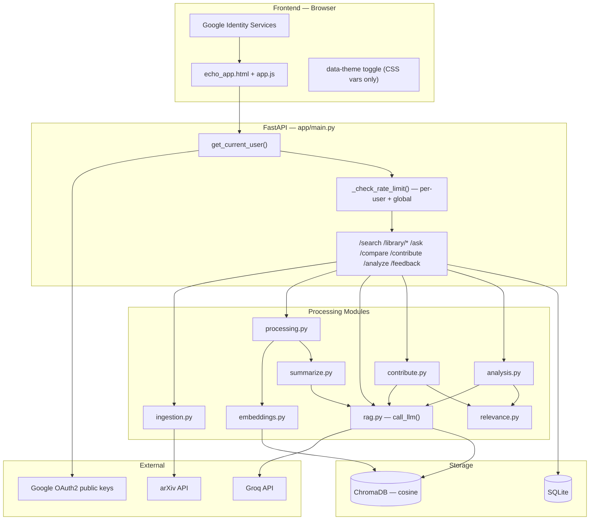
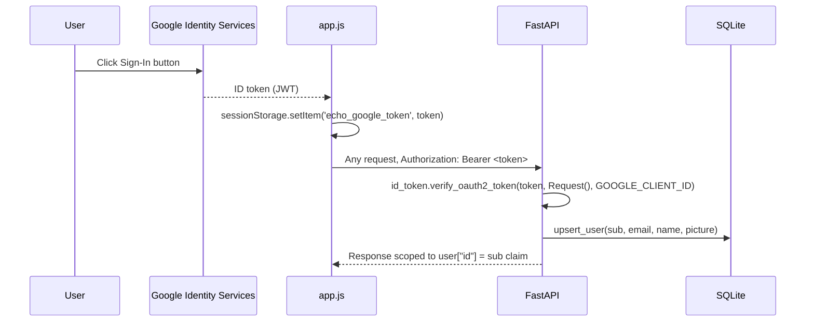
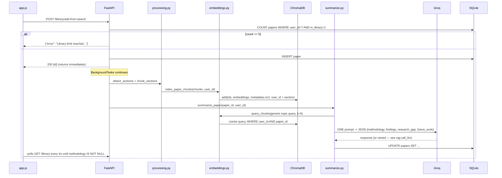
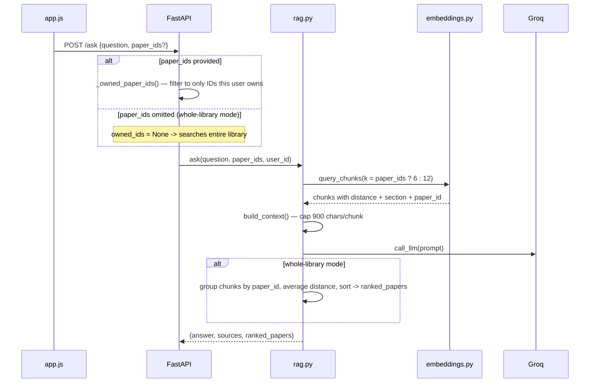
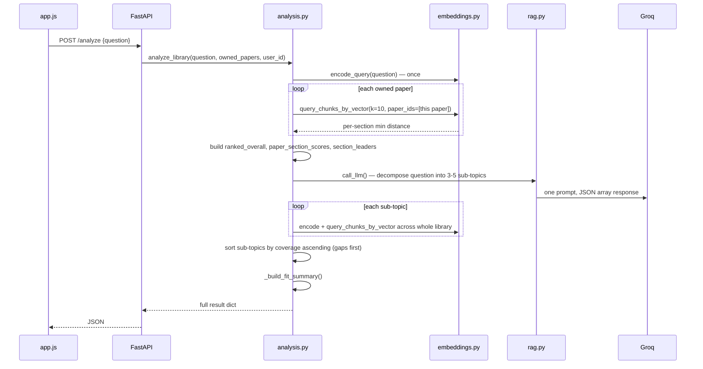

bash

cat > /home/claude/docs/README.md << 'README_EOF'
# Echo — AI Research Assistant


Echo is a multi-user, retrieval-augmented-generation (RAG) research assistant. Every paper a
user adds is parsed, section-detected, chunked, embedded, and stored in an isolated per-user
vector space — so every summary, chat answer, and structural analysis is grounded in real
retrieved text, never the model's general knowledge alone.

This README documents the project at implementation level: exact schemas, exact thresholds
(with the real measurements behind them), the full request/response contract of every
endpoint, and the actual engineering decisions — including the bugs found and fixed along the
way — rather than a marketing-level feature list.

---

## Table of Contents

1. [Philosophy & Scope](#1-philosophy--scope)
2. [Feature Walkthrough](#2-feature-walkthrough)
3. [Tech Stack](#3-tech-stack)
4. [System Architecture](#4-system-architecture)
5. [Data Flow — Sequence Diagrams](#5-data-flow--sequence-diagrams)
6. [Database Schema](#6-database-schema)
7. [Vector Store Schema](#7-vector-store-schema)
8. [Backend File-by-File Reference](#8-backend-file-by-file-reference)
9. [Frontend Architecture](#9-frontend-architecture)
10. [Relevance Scoring — Thresholds & Calibration](#10-relevance-scoring--thresholds--calibration)
11. [Complete API Reference](#11-complete-api-reference)
12. [Environment Variables](#12-environment-variables)
13. [Setup & Installation](#13-setup--installation)
14. [Deployment](#14-deployment)
15. [Security](#15-security)
16. [Engineering Journal — Bugs Found & Fixed](#16-engineering-journal--bugs-found--fixed)
17. [Known Limitations & Roadmap](#17-known-limitations--roadmap)
18. [License & Author](#18-license--author)

---

## 1. Philosophy & Scope

Three deliberate constraints shaped every design decision in this project:

- **Free-tier sustainable.** Every LLM call is minimized and centralized. Summaries use one
  combined call instead of four. Analyze uses one LLM call (question decomposition) regardless
  of library size — everything else is local embedding math. A hard 5-paper library cap exists
  specifically to keep usage within free-tier rate limits.
- **Grounded, not generative.** Every answer — summaries, chat, contribute guidance — is built
  from a prompt containing only retrieved chunks, with an explicit instruction to say "not
  found in sources" rather than guess. Relevance scoring exists to make honest "no good match"
  answers possible, not just to rank things.
- **Real multi-tenancy, not UI-level separation.** `user_id` is enforced at the SQL query level
  and the ChromaDB `where`-filter level on every single read and write — not just hidden by the
  frontend. A user cannot retrieve another user's data by guessing a paper ID, calling an
  endpoint directly, or any other client-side manipulation.

---

## 2. Feature Walkthrough

### 2.1 Authentication (Google Sign-In)
The app opens on a full-screen gate (`#authGate`) rendering an animated "sonar ping" (three
concentric rings pulsing outward from the logo — literal to the product name) and a Google
Identity Services Sign-In button. On success, the returned ID token (a JWT) is stored in
`sessionStorage` under `echo_google_token` and attached as `Authorization: Bearer <token>` on
every subsequent request. The backend never issues its own session tokens — Google's token is
re-verified on every single request server-side.

### 2.2 Search & Upload
- **arXiv search**: query text, adjustable result count (10/15/25/40), optional year-from/year-to
  range, submitted via arXiv's `submittedDate:[YYYYMMDD0000 TO YYYYMMDD2359]` query syntax.
- **PDF upload**: drag-in-equivalent file picker restricted to `application/pdf`. Validated
  server-side (not just by the file picker's `accept` attribute) for MIME type, a 25MB size cap,
  and the literal `%PDF-` magic byte signature before any processing begins.
- Both paths return an ID immediately (HTTP 200) and continue processing in a FastAPI
  `BackgroundTasks` job — the user is never blocked waiting for embedding/summarization.

### 2.3 Library
Shows all of the signed-in user's papers, a live `X/5` cap counter, a diversity badge (see
§2.9), per-card checkboxes for Compare selection, and a "Summarizing..." indicator for papers
still being processed. Polls `GET /library` every 4 seconds while any paper lacks a
`methodology` field, stopping automatically once all papers are fully processed.

### 2.4 Paper & Ask
Shows the four generated summary fields plus a chat panel with two modes, switchable via a
toggle:
- **"This paper"** — chat scoped to `paper_ids: [currentPaperId]`.
- **"Whole library"** — `paper_ids` omitted entirely, triggering library-wide retrieval in
  `rag.ask()`. In this mode, the response includes a `ranked_papers` list showing which papers
  in the library actually contributed to the answer, sorted by relevance, each clickable to jump
  directly to that paper.

A paper-switcher `<select>` lets you jump between library papers without leaving this screen.
The currently-viewed paper persists across page refresh via `sessionStorage`.

### 2.5 Compare
Select 2+ papers in Library; renders a table with one column per paper and one row per summary
field (Methodology / Findings / Research Gap / Future Work), each cell markdown-rendered.

### 2.6 Summaries
A card per library paper showing all four fields at a glance, with quick links to open the full
reader or jump into that paper's chat.

### 2.7 Contribute
A free-text box for describing a research idea. On submit:
1. The idea text is embedded and compared against every chunk in the user's library.
2. The single closest **paper** (by averaged chunk distance) is identified.
3. If that closest paper's distance exceeds `NO_MATCH_THRESHOLD` (0.80 — see §10), the endpoint
   returns an explicit rejection (`"No sufficiently related paper found..."`) instead of forcing
   a match onto an unrelated paper.
4. Otherwise, one LLM call generates exactly 3 concrete, numbered suggestions for extending that
   paper, and a novelty label (Low/Medium/High) is derived from the same distance value.

### 2.8 Analyze
The most structurally detailed feature. Given a research question, produces four outputs in
order:
1. **Fit summary** — a synthesized plain-English readout: how many papers are highly/partially
   relevant, what percentage of auto-derived sub-topics the library covers, and which single
   paper is the weakest fit for *this specific question* (explicitly framed as not a reason to
   remove it — just not a match for this angle).
2. **Ranked papers** — every owned paper, sorted by its best (lowest-distance) matching chunk.
3. **Section leaderboard** — for each canonical section category (Methodology, Findings,
   Introduction, etc. — see §7), which single paper's version of that section is most relevant.
4. **Relevance heatmap** — a papers × sections grid, one cell per combination, color-coded by
   the same three-tier label system used everywhere else, rendered as a pure CSS grid (no
   charting library dependency).
5. **Sub-topic coverage** — the question is decomposed by the LLM into 3–5 short sub-topics
   (one call), then each sub-topic is independently embedded and searched against the whole
   library; a ✅/— grid shows which papers have at least one chunk closely matching each
   sub-topic. Rows are sorted so the *worst-covered* sub-topics surface first.

### 2.9 Library Diversity Score
Independent of any question — always visible on the Library screen. Computed from the average
pairwise cosine distance between papers' `title + methodology + findings` text embeddings.
Higher = less redundant. This is explicitly documented in code as a heuristic guidance signal,
not a validated scientific metric.

### 2.10 Theme (Light / Dark)
A single `data-theme` attribute on `<html>`, toggled via two buttons in the sidebar, persisted
in `localStorage` under `echo_theme`, defaulting to the OS's `prefers-color-scheme` on first
visit. Implemented entirely via CSS custom-property overrides under a `[data-theme="dark"]`
selector — zero JavaScript branching in any render function, zero backend involvement.

---

## 3. Tech Stack

| Layer | Technology | Exact Role |
|---|---|---|
| Backend framework | FastAPI (Python 3.13) | Routing, `BackgroundTasks`, dependency-injected auth (`Depends(get_current_user)`) |
| Authentication | `google-auth` (`google.oauth2.id_token`) | Verifies Google-issued JWTs against Google's public signing keys — no shared secret, no custom token issuance |
| Vector store | ChromaDB (`PersistentClient`) | Single collection `"chunks"`, explicit `metadata={"hnsw:space": "cosine"}` |
| Embedding model | `sentence-transformers` — `all-MiniLM-L6-v2` | 384-dimension embeddings, CPU inference, `model_kwargs={"low_cpu_mem_usage": False}` to avoid a meta-tensor loading bug (see §16) |
| Relational store | SQLite (stdlib `sqlite3`, `Row` factory) | Tables: `users`, `papers`, `feedback` |
| LLM provider | Groq, OpenAI-compatible endpoint (`https://api.groq.com/openai/v1`), model `openai/gpt-oss-120b` | All generation: summaries, chat, contribute guidance, sub-topic decomposition |
| PDF parsing | PyMuPDF (`fitz`) | Text extraction from both uploaded and arXiv-downloaded PDFs |
| External data | arXiv public Atom API | No key required; `xml.etree.ElementTree` parsing |
| Frontend | Vanilla HTML/CSS/JS, single-file `app.js` | No build step, no framework, no bundler |

---

## 4. System Architecture



---

## 5. Data Flow — Sequence Diagrams

### 5.1 Sign-in


### 5.2 Add paper -> background processing


### 5.3 Ask — per-paper vs whole-library


### 5.4 Analyze


---

## 6. Database Schema

```sql
CREATE TABLE users (
    id TEXT PRIMARY KEY,      -- Google 'sub' claim — stable, unique, never reused
    email TEXT,
    name TEXT,
    picture TEXT,
    created_at TEXT           -- ISO 8601, refreshed on every sign-in (profile can change)
);

CREATE TABLE papers (
    id TEXT PRIMARY KEY,      -- UUID4, generated at add-time
    user_id TEXT,             -- FK to users.id (enforced in application code, not SQL constraint)
    title TEXT,
    authors TEXT,             -- comma-joined string, not normalized
    year TEXT,
    venue TEXT,
    source TEXT,               -- "arXiv" | "upload"
    doi TEXT,                  -- arXiv abstract URL, used as a DOI-equivalent identifier
    pdf_url TEXT,
    tags TEXT,                 -- reserved, currently unused
    credibility TEXT DEFAULT 'unscored',  -- reserved, currently unused
    full_text TEXT,             -- complete extracted text, used by the reader modal
    methodology TEXT,
    findings TEXT,
    research_gap TEXT,
    future_work TEXT,
    in_library INTEGER DEFAULT 0,  -- soft-delete flag; DELETE endpoint sets this to 0, never removes the row
    created_at TEXT
);

CREATE TABLE feedback (
    id INTEGER PRIMARY KEY AUTOINCREMENT,
    user_id TEXT,
    target_type TEXT,
    target_id TEXT,
    vote TEXT,
    created_at TEXT
);
```

**Migration behavior**: `db.init_db()` runs `CREATE TABLE IF NOT EXISTS` on every backend
startup, then attempts `ALTER TABLE ... ADD COLUMN user_id TEXT` on `papers` and `feedback`,
catching and ignoring `sqlite3.OperationalError` if the column already exists. This means the
schema self-upgrades on restart but **does not backfill `user_id` for pre-existing rows** —
rows created before the multi-user migration have `user_id = NULL` and become permanently
invisible to every query (which all filter `WHERE user_id = ?`). This was accepted as
intentional during the migration since it only affected local test data.

---

## 7. Vector Store Schema

- **Client**: `chromadb.PersistentClient(path="<repo>/chroma_db")`
- **Collection**: single collection named `"chunks"`, created with
  `metadata={"hnsw:space": "cosine"}` — this must be set at creation time; changing it later
  requires deleting and recreating the collection (Chroma does not support in-place metric
  changes).
- **Chunk ID format**: `"{paper_id}__{chunk_index}"`
- **Per-vector metadata**: `{"paper_id": str, "section": str, "user_id": str}`
- **Section labels** stored on each chunk come from `processing.py`'s heuristic splitter
  (`SECTION_HEADS`: abstract, introduction, related work, background, methodology, method,
  methods, dataset, data, results, experiments, evaluation, discussion, limitations,
  conclusion, conclusions, future work, references — plus a `"body"` fallback for
  unmatched text). `analysis.py`'s `CATEGORY_MAP` canonicalizes these raw labels into
  display categories (e.g. `method`/`methods`/`methodology` all become `"Methodology"`;
  `results`/`experiments`/`evaluation` all become `"Findings"`).
- **Chunking**: 400 words per chunk, 50-word overlap, computed per detected section
  independently (a section's text is never chunked across a section boundary).

---

## 8. Backend File-by-File Reference

| File | Responsibility | Key exports |
|---|---|---|
| `main.py` | FastAPI app instance, CORS config, `get_current_user` auth dependency, every route, rate limiter, library-size cap enforcement, file-upload validation | `app`, `get_current_user()`, `_check_rate_limit()`, `_owned_paper_ids()` |
| `rag.py` | The single hardened LLM call site for the whole app | `call_llm(prompt, max_tokens)` — retries on 429 (backoff), on 413/"too large" (shrinks token budget), on truncation (`finish_reason == "length"`, grows token budget); `ask()` — retrieval + generation, whole-library ranking |
| `summarize.py` | One combined structured-summary generation per paper | `summarize_paper(paper_id, user_id)` — builds one JSON-schema prompt, parses response, falls back to per-field regex extraction if JSON parsing fails |
| `contribute.py` | Idea-to-library similarity matching | `match_idea(idea_text, library_ids, user_id)` — rejects via `relevance.NO_MATCH_THRESHOLD` if nothing is genuinely close |
| `analysis.py` | All Analyze-screen computation | `analyze_library()`, `library_diversity()`, `_decompose_question()`, `_build_fit_summary()`, `canonical_category()` |
| `relevance.py` | Single source of truth for every similarity threshold in the app | `HIGH_RELEVANCE_THRESHOLD`, `RELEVANT_THRESHOLD`, `NO_MATCH_THRESHOLD`, `distance_to_label()`, `is_covered()` |
| `ingestion.py` | External data acquisition | `search_arxiv(query, max_results, year_from, year_to)`, `extract_pdf_text()`, `fetch_arxiv_full_text()` |
| `processing.py` | Turns raw text into indexable chunks | `detect_sections()` (heuristic heading matcher), `chunk_text()`, `chunk_sections()` |
| `embeddings.py` | All ChromaDB and sentence-transformers interaction | `get_model()`, `get_collection()`, `encode_query()`, `query_chunks()`, `query_chunks_by_vector()`, `index_paper_chunks()`, `delete_paper_chunks()` |
| `db.py` | SQLite schema and connection management | `get_conn()`, `init_db()`, `upsert_user()` |

---

## 9. Frontend Architecture

`app.js` is a single file with no module system — every function is global. Structure:

**Global state** (module-level `let`/`const`):
- `library` — array of the current user's papers, refreshed via `refreshLibrary()`
- `selected` — `Set` of paper IDs checked for Compare
- `libraryHealth` — cached response from `GET /library/health`
- `currentPaperId` — persisted in `sessionStorage` key `echo_currentPaperId`
- `chatHistory` — object keyed by paper ID, each value an array of `{role, text, sources?, rankedPapers?}`
- `chatScope` — `'paper'` or `'library'`, reset to `'paper'` on every `renderPaper()` call
- `googleToken` / `currentUser` — auth state, token in `sessionStorage` key `echo_google_token`

**Routing**: `goTo(screenId)` toggles `.active` classes on nav items and `.screen` sections, and
calls the matching `render*()` function for screens that need fresh data on every visit
(`paper`, `compare`, `summaries`, `library`).

**The one API helper**: `api(path, opts)` wraps `fetch`, always attaches the `Authorization`
header, and on a `401` response calls `signOut()` and throws — every caller's `try/catch`
handles the resulting rejection.

**Security utilities used everywhere text is inserted into the DOM**:
- `escapeHtml(str)` — escapes `& < > " '` — applied to every paper title, author list, chat
  message, and filename before `innerHTML` insertion.
- `renderMarkdown(text)` — escapes HTML first, then converts `**bold**`, numbered lists, and
  bullet lists to their HTML equivalents. Applied to every LLM-generated field (summaries,
  chat answers, contribute guidance, compare table cells).

**Polling**: `refreshLibrary()` re-schedules itself via `setTimeout(refreshLibrary, 4000)`
whenever any paper still lacks a `methodology` value, and cancels any pending timer at the
start of each call via `clearTimeout(pollTimer)` to prevent overlapping polling loops.

---

## 10. Relevance Scoring — Thresholds & Calibration

All three thresholds live in `relevance.py` and are imported by every feature that ranks
content by embedding distance (`analysis.py`, `contribute.py`; `rag.py`'s whole-library
ranking uses the same distance values but renders its own labels client-side for that specific
feature).

| Constant | Value | Meaning |
|---|---|---|
| `HIGH_RELEVANCE_THRESHOLD` | `0.45` | Below this cosine distance: "Highly relevant" |
| `RELEVANT_THRESHOLD` | `0.75` | Below this: "Relevant"; at/above: "Loosely relevant" |
| `NO_MATCH_THRESHOLD` | `0.80` | Used only by Contribute — above this, reject the match entirely rather than force one |

**These are measured values, not theoretical ones.** An earlier version used `0.6`/`1.0`,
assuming a standard cosine-distance range where `1.0` represents orthogonal/unrelated vectors.
Direct measurement against this project's actual embedding model
(`all-MiniLM-L6-v2`) contradicted that assumption: a genuinely unrelated query
("I want to make a boat") scored a **best-case distance of 0.864–0.941** across five
real, unrelated library papers. This is a known property of sentence-transformer embedding
spaces called anisotropy — unrelated text pairs cluster closer together than a uniform
distribution over `[0, 2]` would predict. The thresholds were retuned to sit comfortably below
this measured floor, with margin. If the embedding model is ever swapped, this measurement
must be redone — see `check_distance.py`-style diagnostic pattern in §16.

**A second, related fix**: ChromaDB's `PersistentClient.get_or_create_collection()` defaults to
raw L2 (Euclidean) distance if no `metadata={"hnsw:space": ...}` is specified. L2 distance on
non-unit-normalized embeddings has no fixed range, making any absolute threshold meaningless.
`embeddings.py` now explicitly requests `"cosine"` — but because this setting only applies at
collection *creation*, any pre-existing `chroma_db` directory must be deleted and all papers
re-indexed after this change for it to take effect.

---

## 11. Complete API Reference

All endpoints except `/health` require header `Authorization: Bearer <google-id-token>` and
return `401` if missing/invalid.

### `GET /health`
No auth. Returns `{"status": "ok"}`.

### `POST /search`
```json
// Request
{ "query": "string", "max_results": 15, "year_from": "2023", "year_to": "2025" }
// Response
{ "results": [ { "id": "uuid", "title": "...", "abstract": "...", "authors": ["..."], "year": "2024", "source": "arXiv", "venue": "arXiv preprint", "doi": "https://arxiv.org/abs/...", "pdf_url": "https://arxiv.org/pdf/....pdf" } ] }
```
`year_from`/`year_to` are optional; when provided, both default the missing bound (`1990`/`2100`).

### `POST /library/add-from-search`
Request: the full result object from `/search`, plus optional `id` (reuses the arXiv-search-generated UUID).
Response: `{"id": "uuid"}` on success, or `{"error": "Library limit reached (5 papers)..."}` if at cap.

### `POST /library/upload`
`multipart/form-data`, field name `file`. Validated: `content_type == "application/pdf"`,
`len(content) <= 25*1024*1024`, `content.startswith(b"%PDF-")`. Same success/limit-error shape as above.

### `GET /library`
No body. Response: `{"papers": [ {...every column from the papers table...} ]}`, filtered to `in_library=1 AND user_id=<caller>`.

### `DELETE /library/{paper_id}`
Sets `in_library=0` (soft delete) only if `user_id` matches the caller; also calls
`embeddings.delete_paper_chunks(paper_id)` unconditionally (this is a minor asymmetry — chunk
deletion is not ownership-checked at the Chroma layer, since Chroma has no user concept at the
delete-by-`paper_id` call site, but the SQL layer above it already guarantees the caller owns
that `paper_id` before this line executes). Response: `{"ok": true}`.

### `GET /paper/{paper_id}`
Response: full paper row if `user_id` matches, else `{"error": "not found"}` (not `403` —
deliberately indistinguishable from "doesn't exist" to avoid leaking existence of other users' IDs).

### `POST /ask`
```json
// Request
{ "question": "string, max 2000 chars", "paper_ids": ["uuid", "..."] }  // paper_ids omit-able
// Response
{ "answer": "string", "sources": [ {"text","paper_id","section","distance"} ], "ranked_papers": null_or_array }
```
`ranked_papers` is populated only when `paper_ids` was omitted (whole-library mode).
Rate-limited (see §15).

### `POST /compare`
Request: `{"paper_ids": ["uuid", "uuid", ...]}` (2+ required after ownership filtering).
Response: `{"papers": [...]}` or `{"error": "Select at least 2 papers to compare."}`.

### `POST /contribute`
Request: `{"idea": "string, max 2000 chars", "paper_ids": ["uuid", ...]}`.
Response: `{"paper_id", "title", "novelty", "avg_distance", "guidance"}` or
`{"error": "No sufficiently related paper found..."}`. Rate-limited.

### `POST /analyze`
Request: `{"question": "string, max 2000 chars"}` (reuses the `AskReq` schema; `paper_ids` is
ignored here — Analyze always considers the whole library).
Response shape:
```json
{
  "ranked_overall": [ {"paper_id","distance","label","css_class"} ],
  "paper_section_scores": { "<paper_id>": { "<Category>": {"distance","label","css_class"} } },
  "section_leaders": { "<Category>": [ {"paper_id","distance","label","css_class"} ] },
  "subtopics": ["string", "..."],
  "coverage": { "<subtopic>": { "<paper_id>": {"distance","covered"} } },
  "fit_summary": {"high_count","relevant_count","total","coverage_pct","weakest_title"},
  "titles": { "<paper_id>": "title string" }
}
```
Rate-limited.

### `GET /library/health`
No body. Response: `{"score": 0-100_or_null, "label": "string", "pair_count": int}`. No LLM call.

### `POST /feedback`
Request: `{"target_type","target_id","vote"}`. Response: `{"ok": true}`. Fire-and-forget, not currently read anywhere in the UI.

---

## 12. Environment Variables

| Variable | Required | Default | Notes |
|---|---|---|---|
| `GROQ_API_KEY` | Yes | — | From console.groq.com |
| `GROQ_MODEL` | No | `openai/gpt-oss-120b` | Must be a currently-supported Groq model — check console.groq.com/docs/models if a `model_not_found` error appears (model availability changes over time) |
| `GOOGLE_CLIENT_ID` | Yes | — | From Google Cloud Console OAuth Client (Web application type) |
| `ALLOWED_ORIGINS` | No | `http://localhost:5500,http://127.0.0.1:5500` | Comma-separated; **must** include your real deployed frontend URL before going live |

`.env` must be saved as plain UTF-8 **without a byte-order mark**. Windows Notepad frequently
saves files as UTF-8-with-BOM, which causes `python-dotenv` to read the first variable's name
as `"\ufeffVARNAME"` instead of `"VARNAME"` — silently breaking `os.getenv()` lookups with no
visible error. Verify with:
```powershell
python -c "from dotenv import dotenv_values; print(dotenv_values('.env'))"
```
If any key shows a `\ufeff` prefix, re-save with:
```powershell
$content = Get-Content .env -Raw -Encoding utf8
Set-Content -Path .env -Value $content -Encoding ascii
```

---

## 13. Setup & Installation

### Prerequisites
- Python 3.11+ (developed against 3.13)
- A free Groq API key: https://console.groq.com
- A Google OAuth Client ID: https://console.cloud.google.com -> APIs & Services -> Credentials
  -> Create Credentials -> OAuth Client ID -> Web application -> add
  `http://localhost:5500` under Authorized JavaScript origins

### Backend
```powershell
cd backend
python -m venv venv
venv\Scripts\activate
pip install -r requirements.txt
```
Create `backend/.env` per §12, then:
```powershell
uvicorn app.main:app --reload --port 8000
```
Verify: `http://localhost:8000/health` -> `{"status":"ok"}`.

### Frontend
```powershell
cd frontend
python -m http.server 5500
```
Open `http://localhost:5500/echo_app.html`.

### First-run gotchas
- If `embeddings.get_model()` raises `NotImplementedError: Cannot copy out of meta tensor`,
  this is a known `sentence-transformers`/`transformers`/`accelerate` version-combination bug
  — already worked around via `model_kwargs={"low_cpu_mem_usage": False}` in this codebase; if
  it recurs after a dependency upgrade, that's the fix to reapply.
- If ChromaDB throws `RustBindingsAPI object has no attribute 'bindings'`, delete the
  `chroma_db` directory and restart — this indicates a corrupted or version-mismatched local
  vector store, not a code bug.

---

## 14. Deployment

| Piece | Suggested host | Notes |
|---|---|---|
| Backend | Render (free tier) | Root dir `backend`, build `pip install -r requirements.txt`, start `uvicorn app.main:app --host 0.0.0.0 --port $PORT`. Free tier spins down after ~15 min idle (expect a cold-start delay on first request) and uses an **ephemeral filesystem** — `chroma_db` and `echo.db` reset on redeploy/restart unless a paid persistent disk is attached. |
| Frontend | Netlify / Vercel / GitHub Pages | Static files only, no build step. Set `window.ECHO_API_BASE` in `echo_app.html` to the deployed backend URL before deploying. |

Set `GROQ_API_KEY`, `GOOGLE_CLIENT_ID`, and `ALLOWED_ORIGINS` (to the real frontend URL) as
environment variables in the hosting dashboard — never in a committed file. Add the deployed
frontend origin to the Google OAuth Client's Authorized JavaScript origins as well.

---

## 15. Security

| Control | Implementation detail |
|---|---|
| Authentication | Every route except `/health` requires `Authorization: Bearer <google-id-token>`, verified via `google.oauth2.id_token.verify_oauth2_token()` against Google's live public keys — no custom token issuance, nothing to leak. |
| Per-user isolation | Every SQL query filters `WHERE user_id = ?`; every ChromaDB query includes a `user_id` `where`-clause; `_owned_paper_ids()` re-verifies ownership server-side before Compare/Ask ever touch a supplied paper ID list. |
| CORS | `allow_origins` set from `ALLOWED_ORIGINS`, never wildcarded. |
| Rate limiting | In-memory sliding window: 20 requests/user/60s on `/ask`, `/contribute`, `/analyze`, plus a 100-requests/60s **global** backstop shared across all callers (prevents quota drain via many distinct accounts). Resets on process restart — acceptable for a single-instance deployment; would need a Redis-backed limiter for multi-instance hosting. |
| File upload validation | Content-type check, 25MB size cap, `%PDF-` magic-byte check — all three required, not just the file extension. |
| XSS | `escapeHtml()` applied to all user-supplied and external (arXiv) text before any `innerHTML` insertion; `renderMarkdown()` escapes first, then applies formatting, so markdown syntax can't be used to smuggle raw HTML. |
| Input length limits | `question` and `idea` fields capped at 2000 characters via Pydantic `Field(max_length=2000)` — rejected with `422` before reaching any LLM call. |
| Secrets hygiene | `.env` is gitignored. **Lesson learned during development**: a key committed to git history remains recoverable even after being deleted in a later commit or added to `.gitignore` afterward — `git log -p --all` will still show it. The only real fix once exposed is rotating the key immediately; `git filter-repo --path backend/.env --invert-paths --force` plus a forced push is required to scrub history, and even that doesn't un-expose a key that was already live on a public remote. |

---

## 16. Engineering Journal — Bugs Found & Fixed

A record of non-obvious issues discovered during development, kept because the *reasoning*
behind each fix is often more valuable than the diff itself.

| Bug | Symptom | Root Cause | Fix |
|---|---|---|---|
| `.env` silently not loading | `openai.OpenAIError: api_key must be set` despite a correct-looking `.env` | Windows Notepad saved the file as UTF-8-with-BOM; `python-dotenv` parsed the first key as `"\ufeffXAI_API_KEY"` | Explicit `load_dotenv(dotenv_path=Path(__file__).resolve().parent.parent / ".env")` plus re-saving the file as plain ASCII |
| ChromaDB `RustBindingsAPI` crash | Every background summarization failed | Corrupted/stale local Chroma database directory | Delete `chroma_db`, reinstall `chromadb`, let it recreate fresh |
| Identical truncated JSON in all 4 summary fields | Every field showed the same cut-off `{"methodology": "..."` string | `max_tokens` too low for a reasoning model whose internal "thinking" tokens count against the same budget as the visible answer | Raised `max_tokens`, added `finish_reason == "length"` detection with automatic retry-with-more-tokens in `call_llm()` |
| `413 Request too large` from Groq | Summarization failed for longer papers | Prompt (context chunks) + `max_tokens` together exceeded the provider's per-request token budget | Capped each chunk to 900 characters in `build_context()`; added automatic retry-with-fewer-tokens on this specific error in `call_llm()` |
| Chat scope toggle text invisible | Clicking between "This paper"/"Whole library" made one button's label disappear | Reused a `.btn-ghost` style (dark text, transparent background) designed for light card backgrounds inside a *dark* chat panel — dark-on-dark | New `.scope-btn`/`.scope-btn.active` classes with contrast correct for the dark panel |
| Chat input "not accepting" typed text | User reported keystrokes doing nothing after switching scope | Clicking a `<button>` moves keyboard focus to that button natively; typing without re-clicking the input sent keystrokes nowhere | `setChatScope()` now calls `chatInput.focus()` after toggling |
| Everything scored "Relevant" regardless of topic (e.g., "I want to make a boat" against LLM papers) | Analyze/Contribute treated obviously unrelated queries as relevant | ChromaDB's collection defaulted to raw L2 distance (unbounded range) instead of cosine distance (bounded, threshold-friendly); additionally, initial cosine thresholds were set from theory, not measurement, and were miscalibrated for this embedding model's anisotropic space | Explicit `metadata={"hnsw:space": "cosine"}` at collection creation (required full `chroma_db` reset + re-indexing); thresholds re-measured empirically and tightened in `relevance.py` |
| `NotImplementedError: Cannot copy out of meta tensor` | Analyze/Contribute crashed with a 500 on every request | A `sentence-transformers`/`transformers`/`accelerate` version combination lazily initializes model weights on a placeholder "meta" device; `.to("cpu")` cannot populate real data into a meta tensor | `model_kwargs={"low_cpu_mem_usage": False}` forces real weight loading up front |
| Contribute never rejected unrelated ideas despite having a rejection threshold | `NO_MATCH_THRESHOLD` was set to `1.3`, but real unrelated-query distances topped out around `0.94` — the threshold was unreachable in practice | Same root cause as the relevance-scoring bug above | Retuned to `0.80`, centralized in `relevance.py` alongside the other two thresholds |

---

## 17. Known Limitations & Roadmap

- **5-paper cap is hard-coded** (`MAX_LIBRARY_PAPERS` in `main.py`) — a deliberate cost control,
  trivially raised if paid API headroom exists.
- **Citation-network visualization and cross-corpus trend prediction** are out of scope — would
  require a citation graph data source beyond arXiv's Atom API.
- **Relevance scoring is a similarity estimate, not ground truth.** Borderline cases near a
  threshold will always be somewhat fuzzy; ranked *order* is more trustworthy than any single
  absolute label.
- **SQLite + local ChromaDB are not built for concurrent multi-instance write load.** Fine for
  personal or light demo use; a real multi-instance deployment would need a hosted
  Postgres/pgvector migration.
- **One LLM provider configured at a time.** The swap is small (`base_url` + `api_key` in
  `rag.py`) but not hot-swappable at runtime without a restart.
- **Ephemeral storage on most free hosting tiers** (see §14) — data resets on redeploy unless a
  persistent disk is attached.

---

## 18. License & Author

Licensed under the [Apache License 2.0](./LICENSE).

Built by **Muhammad Shees**.
README_EOF
echo "done, line count:"
wc -l /home/claude/docs/README.md
