# Echo — AI Research Assistant


Echo is a multi-user, retrieval-augmented-generation (RAG) research assistant. Every paper a
user adds is downloaded, parsed, section-detected, chunked, embedded, and stored in an isolated
per-user vector space — so every summary, chat answer, and structural analysis is grounded in
real retrieved text, never the model's general knowledge alone.

This README documents the project at implementation level: exact schemas, exact thresholds
(with the real measurements behind them), the full request/response contract of every
endpoint, and the actual engineering decisions — including every bug found and fixed along the
way, through a full production migration — rather than a marketing-level feature list.

---

## Screenshots

> Add a screenshot for each screen below into a `screenshots/` folder at the repo root, using
> the exact filenames referenced here (dark theme recommended — it's the default). GitHub
> renders these automatically once the files exist; nothing else needs to change.

<table>
<tr>
  <td width="50%">
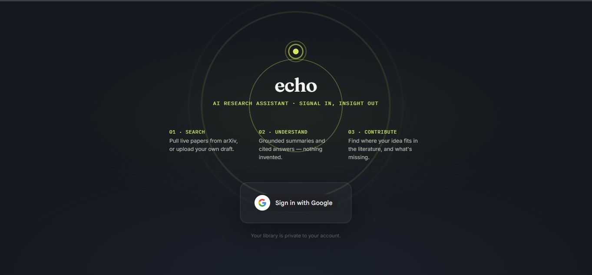
<br><sub><b>Library</b> — 5-paper cap, diversity score, per-paper processing status</sub>
</td>

<td width="50%">
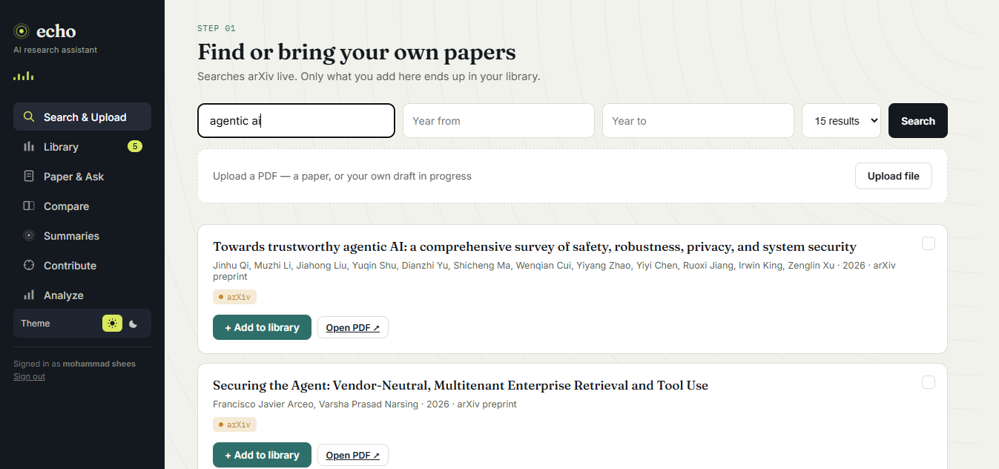
<br><sub><b>Search & Upload</b> — live arXiv search with year filtering, multi-select batch add, and PDF upload</sub>
</td>
<td width="50%">
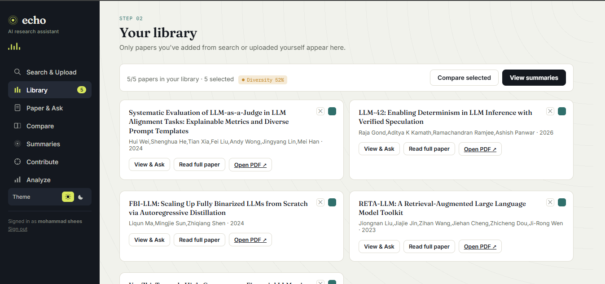
<br><sub><b>Library</b> — 5-paper cap, diversity score, per-paper processing status</sub>
</td>
</tr>
<tr>
<td width="50%">
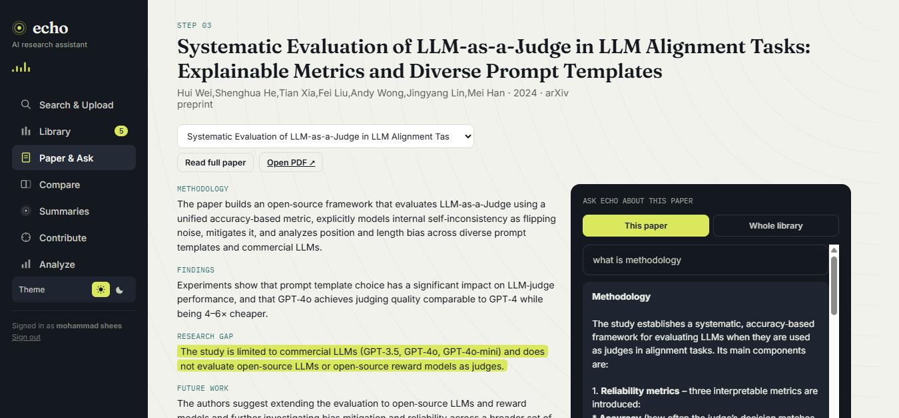
<br><sub><b>Paper & Ask</b> — four-field summary plus a scoped chat panel (this paper / whole library)</sub>
</td>
<td width="50%">
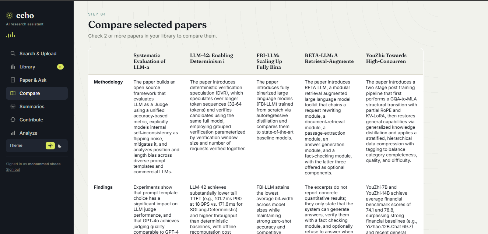
<br><sub><b>Compare</b> — side-by-side summary fields across 2+ selected papers</sub>
</td>
</tr>
<tr>
<td width="50%">
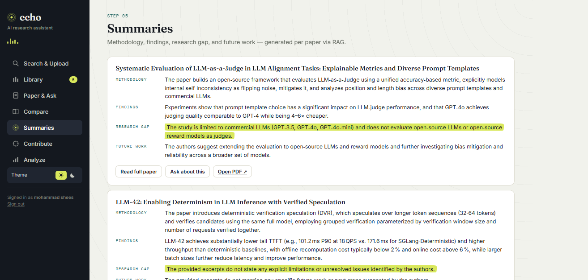
<br><sub><b>Summaries</b> — every paper's four fields at a glance</sub>
</td>
<td width="50%">
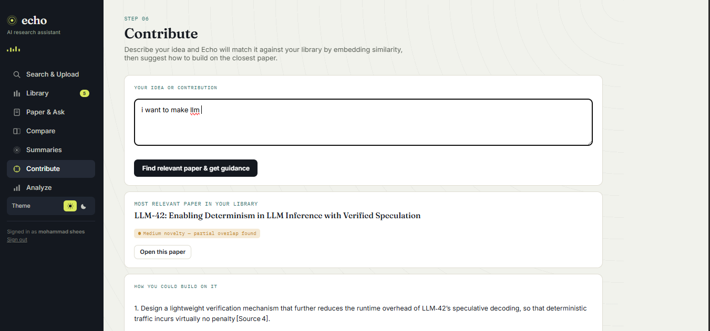
<br><sub><b>Contribute</b> — embedding-matched idea-to-literature fit, with a novelty label</sub>
</td>
</tr>
<tr>
<td width="50%">
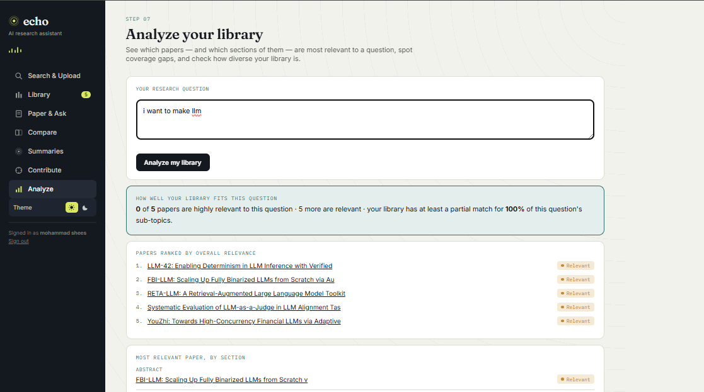
<br><sub><b>Analyze</b> — relevance heatmap and sub-topic coverage grid across the whole library</sub>
</td>

  

</tr>
</table>

---

## Table of Contents

1. [Philosophy & Scope](#1-philosophy--scope)
2. [Feature Walkthrough](#2-feature-walkthrough)
3. [Tech Stack](#3-tech-stack)
4. [System Architecture](#4-system-architecture)
5. [Data Flow — Sequence Diagrams](#5-data-flow--sequence-diagrams)
6. [Database & Vector Store Schema](#6-database--vector-store-schema)
7. [Backend File-by-File Reference](#7-backend-file-by-file-reference)
8. [Frontend Architecture](#8-frontend-architecture)
9. [Relevance Scoring — Thresholds & Calibration](#9-relevance-scoring--thresholds--calibration)
10. [Complete API Reference](#10-complete-api-reference)
11. [Environment Variables](#11-environment-variables)
12. [Setup & Installation](#12-setup--installation)
13. [Deployment](#13-deployment)
14. [Security](#14-security)
15. [Engineering Journal — Bugs Found & Fixed](#15-engineering-journal--bugs-found--fixed)
16. [Known Limitations & Roadmap](#16-known-limitations--roadmap)
17. [License & Author](#17-license--author)

---

## 1. Philosophy & Scope

Three deliberate constraints shaped every design decision in this project:

- **Free-tier sustainable.** Every LLM call is minimized and centralized. Summaries use one
  combined call instead of four. Analyze uses one LLM call (question decomposition) regardless
  of library size — everything else is local embedding math. A hard 5-paper library cap exists
  specifically to keep usage within free-tier rate limits, and background processing is
  deliberately serialized (one paper at a time) to stay under the memory ceiling of a free-tier
  compute instance — see §15 for why that trade-off was necessary in practice, not just in theory.
- **Grounded, not generative.** Every answer — summaries, chat, contribute guidance — is built
  from a prompt containing only retrieved chunks, with an explicit instruction to say "not
  found in sources" rather than guess. Relevance scoring exists to make honest "no good match"
  answers possible, not just to rank things.
- **Real multi-tenancy, not UI-level separation.** `user_id` is enforced at the SQL query level
  and the vector-search `WHERE`-filter level on every single read and write — not just hidden by
  the frontend. A user cannot retrieve another user's data by guessing a paper ID, calling an
  endpoint directly, or any other client-side manipulation.
- **Durable by default.** Every piece of user data — papers, summaries, and embeddings — lives
  in a hosted Postgres database (Supabase), not on the compute instance's local disk. This was
  not the original design; §15 documents why local SQLite + a local vector store is a trap on
  any free-tier host with an ephemeral filesystem, and what migrating away from it actually
  involved.

---

## 2. Feature Walkthrough

### 2.1 Authentication (Google Sign-In)
The app opens on a full-screen gate (`#authGate`) rendering an animated "sonar ping" (three
concentric rings pulsing outward from the logo — literal to the product name) and a Google
Identity Services Sign-In button. On success, the returned ID token (a JWT) is stored in
`sessionStorage` under `echo_google_token` and attached as `Authorization: Bearer <token>` on
every subsequent request. The backend never issues its own session tokens — Google's token is
re-verified on every single request server-side. Tokens expire after roughly an hour; the
frontend detects a `401` and signs the user out cleanly rather than leaving them stuck on a
broken screen.

### 2.2 Search & Upload
- **arXiv search**: query text, adjustable result count (10/15/25/40), optional year-from/year-to
  range, submitted via arXiv's `submittedDate:[YYYYMMDD0000 TO YYYYMMDD2359]` query syntax.
- **Multi-select batch add**: each search result has a checkbox; checking several and clicking
  "+ Add N to library" adds them automatically, one at a time, in sequence — no need to
  re-click into the results list between each one. Adding is deliberately sequential on the
  frontend (each request awaited before the next fires) and the backend additionally serializes
  the actual heavy processing regardless of how the requests arrive (see §15) — both layers
  exist because either one alone was insufficient to prevent memory crashes under a real batch
  add.
- **PDF upload**: file picker restricted to `application/pdf`. Validated server-side (not just
  by the file picker's `accept` attribute) for MIME type, a 25MB size cap, and the literal
  `%PDF-` magic byte signature before any processing begins.
- Both paths return an ID **immediately** (HTTP 200) — the actual PDF download and text
  extraction happen entirely in a background task, not inside the request. This matters more
  than it sounds: a slow or large PDF fetched synchronously can exceed the hosting platform's
  own reverse-proxy timeout, which then returns a bare timeout page with no CORS headers at
  all — the browser reports that as a misleading "blocked by CORS policy" error, which has
  nothing to do with CORS configuration. Moving the fetch to the background eliminates this
  failure mode entirely (see §15).

### 2.3 Library
Shows all of the signed-in user's papers, a live `X/5` cap counter, a diversity badge (see
§2.9), per-card checkboxes for Compare selection, and a "Summarizing..." indicator for papers
still being processed. Removing a paper shows an inline spinner on its remove button while the
deletion is in flight, so the action never looks unresponsive. Polls `GET /library` every 4
seconds while any paper lacks a `methodology` field, stopping automatically once all papers are
fully processed.

### 2.4 Paper & Ask
Shows the four generated summary fields plus a chat panel with two modes, switchable via a
toggle:
- **"This paper"** — chat scoped to `paper_ids: [currentPaperId]`.
- **"Whole library"** — `paper_ids` omitted entirely, triggering library-wide retrieval in
  `rag.ask()`. In this mode, the response includes a `ranked_papers` list showing which papers
  in the library actually contributed to the answer, sorted by relevance, each clickable to jump
  directly to that paper.

A paper-switcher `<select>` lets you jump between library papers without leaving this screen.
The currently-viewed paper persists across page refresh via `sessionStorage`.

### 2.5 Compare
Select 2+ papers in Library; renders a table with one column per paper and one row per summary
field (Methodology / Findings / Research Gap / Future Work), each cell markdown-rendered.

### 2.6 Summaries
A card per library paper showing all four fields at a glance, with quick links to open the full
reader or jump into that paper's chat.

### 2.7 Contribute
A free-text box for describing a research idea. On submit:
1. The idea text is embedded and compared against every chunk in the user's library.
2. The single closest **paper** (by averaged chunk distance) is identified.
3. If that closest paper's distance exceeds `NO_MATCH_THRESHOLD` (0.80 — see §9), the endpoint
   returns an explicit rejection (`"No sufficiently related paper found..."`) instead of forcing
   a match onto an unrelated paper.
4. Otherwise, one LLM call generates exactly 3 concrete, numbered suggestions for extending that
   paper, and a novelty label (Low/Medium/High) is derived from the same distance value.

### 2.8 Analyze
The most structurally detailed feature. Given a research question, produces four outputs in
order:
1. **Fit summary** — a synthesized plain-English readout: how many papers are highly/partially
   relevant, what percentage of auto-derived sub-topics the library covers, and which single
   paper is the weakest fit for *this specific question* (explicitly framed as not a reason to
   remove it — just not a match for this angle).
2. **Ranked papers** — every owned paper, sorted by its best (lowest-distance) matching chunk.
3. **Section leaderboard** — for each canonical section category (Methodology, Findings,
   Introduction, etc. — see §6), which single paper's version of that section is most relevant.
4. **Relevance heatmap** — a papers × sections grid, one cell per combination, color-coded by
   the same three-tier label system used everywhere else, rendered as a pure CSS grid (no
   charting library dependency).
5. **Sub-topic coverage** — the question is decomposed by the LLM into 3–5 short sub-topics
   (one call), then each sub-topic is independently embedded and searched against the whole
   library; a colored-dot grid shows which papers have at least one chunk closely matching each
   sub-topic. Rows are sorted so the *worst-covered* sub-topics surface first.

### 2.9 Library Diversity Score
Independent of any question — always visible on the Library screen. Computed from the average
pairwise cosine distance between papers' `title + methodology + findings` text embeddings.
Higher = less redundant. This is explicitly documented in code as a heuristic guidance signal,
not a validated scientific metric.

### 2.10 Theme (Light / Dark)
A single `data-theme` attribute on `<html>`, toggled via two buttons in the sidebar, persisted
in `localStorage` under `echo_theme`, defaulting to the OS's `prefers-color-scheme` on first
visit. Implemented entirely via CSS custom-property overrides under a `[data-theme="dark"]`
selector — zero JavaScript branching in any render function, zero backend involvement.

### 2.11 Mobile Navigation
Below an 820px viewport width, the sidebar collapses into a slim sticky top bar (logo + a
hamburger button); tapping the hamburger slides the full nav open beneath it, and selecting any
screen auto-closes it. Above that breakpoint, nothing changes — the collapsible wrapper behaves
as a plain flex column with no visual difference from the original desktop sidebar.

---

## 3. Tech Stack

| Layer | Technology | Exact Role |
|---|---|---|
| Backend framework | FastAPI (Python 3.11) | Routing, `BackgroundTasks`, dependency-injected auth (`Depends(get_current_user)`) |
| Authentication | `google-auth` (`google.oauth2.id_token`) | Verifies Google-issued JWTs against Google's public signing keys — no shared secret, no custom token issuance |
| Database + vector store | **Supabase (managed Postgres) with the `pgvector` extension** | One database serves both relational data (`users`, `papers`, `feedback`) and vector search (`chunks.embedding`, queried via the `<=>` cosine-distance operator) — no separate vector database service |
| Connection | `psycopg2`, via Supabase's **Session Pooler** (not the Direct Connection string) | See §15 — Supabase's direct-connection hostname resolves to IPv6-only on new projects, which most PaaS hosts (including Render) can't route outbound; the session pooler is IPv4-compatible |
| Embedding model | `fastembed` — `sentence-transformers/all-MiniLM-L6-v2` (ONNX build) | 384-dimension embeddings, runs on `onnxruntime` — no `torch` dependency at all, which matters directly for staying under a free-tier memory ceiling (see §15) |
| LLM provider | Groq, OpenAI-compatible endpoint (`https://api.groq.com/openai/v1`) | All generation: summaries, chat, contribute guidance, sub-topic decomposition |
| PDF parsing | PyMuPDF, imported as `import pymupdf as fitz` | Text extraction from both uploaded and arXiv-downloaded PDFs; the modern import avoids a deprecation warning from the older `import fitz` style |
| External data | arXiv public Atom API | No key required; `xml.etree.ElementTree` parsing |
| Frontend | Vanilla HTML/CSS/JS, single-file `app.js` | No build step, no framework, no bundler |
| Backend host | Render (free tier) | Single web service, no persistent disk needed — all state lives in Supabase |
| Frontend host | Cloudflare Pages | Deployed via direct upload (`wrangler pages deploy`), not a Git-connected build — see §13 for why |

---

## 4. System Architecture

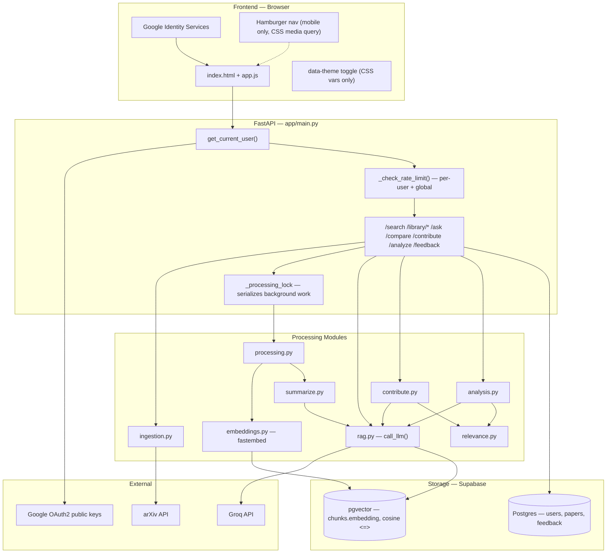

---

## 5. Data Flow — Sequence Diagrams

### 5.1 Sign-in
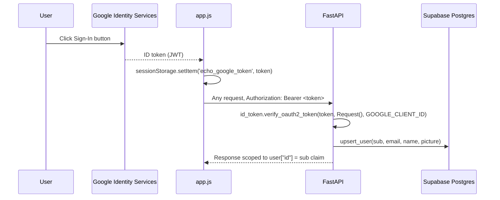

### 5.2 Add paper -> background processing
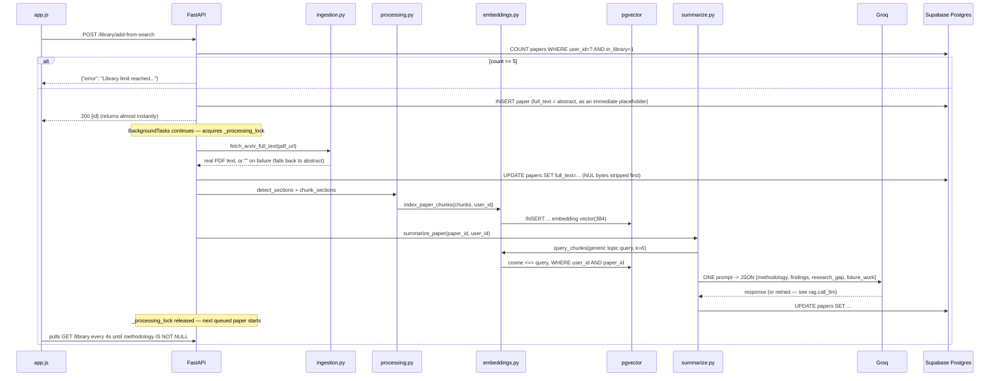

### 5.3 Ask — per-paper vs whole-library
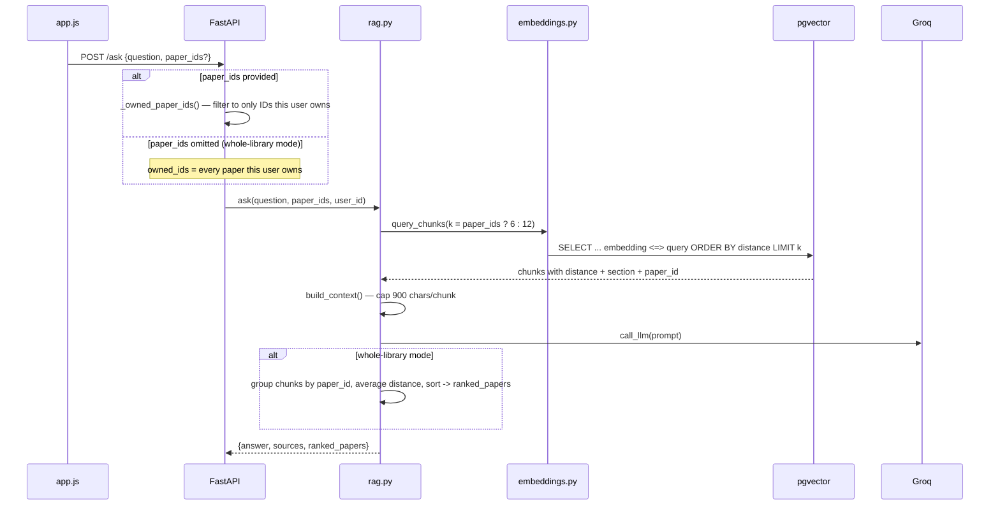

### 5.4 Analyze


---

## 6. Database & Vector Store Schema

Everything lives in one Supabase Postgres database — there is no separate vector database
service. The `pgvector` extension turns a normal Postgres column into something that supports
similarity search via the `<=>` (cosine distance) operator, directly in SQL.

```sql
CREATE EXTENSION IF NOT EXISTS vector;

CREATE TABLE users (
    id TEXT PRIMARY KEY,      -- Google 'sub' claim — stable, unique, never reused
    email TEXT,
    name TEXT,
    picture TEXT,
    created_at TEXT           -- ISO 8601, refreshed on every sign-in (profile can change)
);

CREATE TABLE papers (
    id TEXT PRIMARY KEY,      -- UUID4, generated at add-time
    user_id TEXT,             -- FK to users.id (enforced in application code, not a SQL constraint)
    title TEXT,
    authors TEXT,             -- comma-joined string, not normalized
    year TEXT,
    venue TEXT,
    source TEXT,               -- "arXiv" | "upload"
    doi TEXT,                  -- arXiv abstract URL, used as a DOI-equivalent identifier
    pdf_url TEXT,
    tags TEXT,                 -- reserved, currently unused
    credibility TEXT DEFAULT 'unscored',  -- reserved, currently unused
    full_text TEXT,             -- complete extracted text, used by the reader modal; stored as
                                 -- the abstract immediately, then overwritten with real PDF text
                                 -- by the background task once fetched (see §5.2, §15)
    methodology TEXT,
    findings TEXT,
    research_gap TEXT,
    future_work TEXT,
    in_library INTEGER DEFAULT 0,  -- soft-delete flag; DELETE endpoint sets this to 0, never removes the row
    created_at TEXT
);

CREATE TABLE feedback (
    id SERIAL PRIMARY KEY,
    user_id TEXT,
    target_type TEXT,
    target_id TEXT,
    vote TEXT,
    created_at TEXT
);

-- Replaces what used to be a separate local ChromaDB store. One row per
-- indexed chunk; embedding is a pgvector column, so similarity search is a
-- normal SQL query instead of a call into a separate service/process.
CREATE TABLE chunks (
    id TEXT PRIMARY KEY,       -- "{paper_id}__{chunk_index}"
    paper_id TEXT,
    user_id TEXT,
    section TEXT,
    text TEXT,
    embedding vector(384)      -- all-MiniLM-L6-v2 output size
);
```

**Migration behavior**: `db.init_db()` runs the extension + `CREATE TABLE IF NOT EXISTS`
statements on every backend startup, then runs `ALTER TABLE ... ADD COLUMN IF NOT EXISTS
user_id TEXT` on `papers` and `feedback`. This means the schema self-upgrades on restart, the
same way the old SQLite version did — but unlike SQLite, this now runs against a durable,
shared database that isn't wiped when the compute instance restarts.

**Section labels** stored on each chunk come from `processing.py`'s heuristic splitter
(`SECTION_HEADS`: abstract, introduction, related work, background, methodology, method,
methods, dataset, data, results, experiments, evaluation, discussion, limitations,
conclusion, conclusions, future work, references — plus a `"body"` fallback for
unmatched text). `analysis.py`'s `CATEGORY_MAP` canonicalizes these raw labels into
display categories (e.g. `method`/`methods`/`methodology` all become `"Methodology"`;
`results`/`experiments`/`evaluation` all become `"Findings"`).

**Chunking**: 400 words per chunk, 50-word overlap, computed per detected section
independently (a section's text is never chunked across a section boundary).

**Querying**: retrieval is a plain SQL statement —
```sql
SELECT paper_id, section, text, embedding <=> %s AS distance
FROM chunks
WHERE user_id = %s AND paper_id = ANY(%s)
ORDER BY embedding <=> %s
LIMIT %s
```
`<=>` is pgvector's cosine-distance operator; at this library's scale (a 5-paper cap per user)
a plain sequential scan is entirely fast enough — no `ivfflat` index was needed.

---

## 7. Backend File-by-File Reference

| File | Responsibility | Key exports |
|---|---|---|
| `main.py` | FastAPI app instance, CORS config, `get_current_user` auth dependency, every route, rate limiter, library-size cap enforcement, file-upload validation, background-task orchestration + the global processing lock | `app`, `get_current_user()`, `_check_rate_limit()`, `_owned_paper_ids()`, `_fetch_index_and_summarize()` |
| `db.py` | Postgres (Supabase) connection management, schema init | `get_conn()` — returns a thin `ConnWrapper` so the rest of the codebase can keep using sqlite3-style `conn.execute(sql_with_question_marks, params)`; `init_db()`, `upsert_user()` |
| `rag.py` | The single hardened LLM call site for the whole app | `call_llm(prompt, max_tokens)` — retries on 429 (backoff), on 413/"too large" (shrinks token budget), on truncation (`finish_reason == "length"`, grows token budget); `ask()` — retrieval + generation, whole-library ranking |
| `summarize.py` | One combined structured-summary generation per paper | `summarize_paper(paper_id, user_id)` — builds one JSON-schema prompt, parses response, falls back to per-field regex extraction if JSON parsing fails |
| `contribute.py` | Idea-to-library similarity matching | `match_idea(idea_text, library_ids, user_id)` — rejects via `relevance.NO_MATCH_THRESHOLD` if nothing is genuinely close |
| `analysis.py` | All Analyze-screen computation, plus library diversity scoring | `analyze_library()`, `library_diversity()`, `_decompose_question()`, `_build_fit_summary()`, `canonical_category()` |
| `relevance.py` | Single source of truth for every similarity threshold in the app | `HIGH_RELEVANCE_THRESHOLD`, `RELEVANT_THRESHOLD`, `NO_MATCH_THRESHOLD`, `distance_to_label()`, `is_covered()` |
| `ingestion.py` | External data acquisition | `search_arxiv(query, max_results, year_from, year_to)`, `extract_pdf_text()`, `fetch_arxiv_full_text()` |
| `processing.py` | Turns raw text into indexable chunks | `detect_sections()` (heuristic heading matcher), `chunk_text()`, `chunk_sections()` |
| `embeddings.py` | All pgvector and fastembed interaction | `get_model()` (thread-safe lazy singleton — see §15), `embed_texts()`, `encode_query()`, `query_chunks()`, `query_chunks_by_vector()`, `index_paper_chunks()`, `delete_paper_chunks()` |

---

## 8. Frontend Architecture

`app.js` is a single file with no module system — every function is global. Structure:

**Global state** (module-level `let`/`const`):
- `library` — array of the current user's papers, refreshed via `refreshLibrary()`
- `selected` — `Set` of paper IDs checked for Compare
- `searchSelected` — `Set` of search-result IDs checked for batch add
- `removingIds` — `Set` of paper IDs currently mid-deletion, used to render the remove-button spinner
- `libraryHealth` — cached response from `GET /library/health`
- `currentPaperId` — persisted in `sessionStorage` key `echo_currentPaperId`
- `chatHistory` — object keyed by paper ID, each value an array of `{role, text, sources?, rankedPapers?}`
- `chatScope` — `'paper'` or `'library'`, reset to `'paper'` on every `renderPaper()` call
- `googleToken` / `currentUser` — auth state, token in `sessionStorage` key `echo_google_token`

**Routing**: `goTo(screenId)` toggles `.active` classes on nav items and `.screen` sections,
calls the matching `render*()` function for screens that need fresh data on every visit, and
closes the mobile hamburger panel if it's open — a no-op on desktop since that only has a
visual effect inside the mobile media query.

**The one API helper**: `api(path, opts)` wraps `fetch`, always attaches the `Authorization`
header, and on a `401` response calls `signOut()` and throws — every caller's `try/catch`
handles the resulting rejection.

**Security utilities used everywhere text is inserted into the DOM**:
- `escapeHtml(str)` — escapes `& < > " '` — applied to every paper title, author list, chat
  message, and filename before `innerHTML` insertion.
- `renderMarkdown(text)` — escapes HTML first, then converts `**bold**`, numbered lists, and
  bullet lists to their HTML equivalents. Applied to every LLM-generated field (summaries,
  chat answers, contribute guidance, compare table cells).

**Polling**: `refreshLibrary()` re-schedules itself via `setTimeout(refreshLibrary, 4000)`
whenever any paper still lacks a `methodology` value, and cancels any pending timer at the
start of each call via `clearTimeout(pollTimer)` to prevent overlapping polling loops.

**Mobile nav**: `toggleMobileNav()` / `closeMobileNav()` toggle a class on the collapsible
sidebar panel — purely presentational, touches no app state.

**Batch add**: `addSelectedToLibrary()` iterates the checked search results sequentially,
`await`-ing each `/library/add-from-search` call before starting the next, stopping early with
a clear message if the 5-paper cap is hit mid-batch.

**Cache-busting reminder**: `app.js` is loaded as `<script src="app.js?v=N">`. Bump `N` in
`index.html` every time `app.js` changes — see §15 for what happens when this is forgotten
(the browser and Cloudflare's edge can both keep serving a stale cached copy indefinitely).

---

## 9. Relevance Scoring — Thresholds & Calibration

All three thresholds live in `relevance.py` and are imported by every feature that ranks
content by embedding distance (`analysis.py`, `contribute.py`; `rag.py`'s whole-library
ranking uses the same distance values but renders its own labels client-side for that specific
feature).

| Constant | Value | Meaning |
|---|---|---|
| `HIGH_RELEVANCE_THRESHOLD` | `0.45` | Below this cosine distance: "Highly relevant" |
| `RELEVANT_THRESHOLD` | `0.75` | Below this: "Relevant"; at/above: "Loosely relevant" |
| `NO_MATCH_THRESHOLD` | `0.80` | Used only by Contribute — above this, reject the match entirely rather than force one |

**These are measured values, not theoretical ones.** An earlier version used `0.6`/`1.0`,
assuming a standard cosine-distance range where `1.0` represents orthogonal/unrelated vectors.
Direct measurement against the embedding model actually in use contradicted that assumption: a
genuinely unrelated query ("I want to make a boat") scored a **best-case distance of
0.864–0.941** across five real, unrelated library papers. This is a known property of
sentence-transformer embedding spaces called anisotropy — unrelated text pairs cluster closer
together than a uniform distribution over `[0, 2]` would predict. The thresholds were retuned to
sit comfortably below this measured floor, with margin.

pgvector's `<=>` cosine-distance operator produces the same `1 - cosine_similarity` range as the
`chromadb`-based implementation this project originally used, so these thresholds carried over
unchanged through the Postgres migration — this was verified explicitly rather than assumed,
since a different range here would have silently broken every relevance label in the app.

---

## 10. Complete API Reference

All endpoints except `/health` and `/config/relevance` require header
`Authorization: Bearer <google-id-token>` and return `401` if missing/invalid.

### `GET /health`
No auth. Returns `{"status": "ok"}`.

### `GET /config/relevance`
No auth. Returns the same thresholds/labels `relevance.py` uses server-side, so the frontend
never hardcodes a number that could drift out of sync.

### `POST /search`
```json
// Request
{ "query": "string", "max_results": 15, "year_from": "2023", "year_to": "2025" }
// Response
{ "results": [ { "id": "uuid", "title": "...", "abstract": "...", "authors": ["..."], "year": "2024", "source": "arXiv", "venue": "arXiv preprint", "doi": "https://arxiv.org/abs/...", "pdf_url": "https://arxiv.org/pdf/....pdf" } ] }
```
`year_from`/`year_to` are optional; when provided, both default the missing bound (`1990`/`2100`).

### `POST /library/add-from-search`
Request: the full result object from `/search`, plus optional `id` (reuses the arXiv-search-generated UUID).
Response: `{"id": "uuid"}` — returned almost immediately; the real PDF fetch, chunking,
embedding, and summarization all happen afterward in the background (see §5.2, §15).
Or `{"error": "Library limit reached (5 papers)..."}` if at cap.

### `POST /library/upload`
`multipart/form-data`, field name `file`. Validated: `content_type == "application/pdf"`,
`len(content) <= 25*1024*1024`, `content.startswith(b"%PDF-")`. Same success/limit-error shape as above.

### `GET /library`
No body. Response: `{"papers": [ {...every column from the papers table...} ]}`, filtered to `in_library=1 AND user_id=<caller>`.

### `DELETE /library/{paper_id}`
Sets `in_library=0` (soft delete) only if `user_id` matches the caller; also calls
`embeddings.delete_paper_chunks(paper_id)` unconditionally. Response: `{"ok": true}`.

### `GET /paper/{paper_id}`
Response: full paper row if `user_id` matches, else `{"error": "not found"}` (not `403` —
deliberately indistinguishable from "doesn't exist" to avoid leaking existence of other users' IDs).

### `POST /ask`
```json
// Request
{ "question": "string, max 2000 chars", "paper_ids": ["uuid", "..."] }  // paper_ids omit-able
// Response
{ "answer": "string", "sources": [ {"text","paper_id","section","distance"} ], "ranked_papers": null_or_array }
```
`ranked_papers` is populated only when `paper_ids` was omitted (whole-library mode).
Rate-limited (see §14).

### `POST /compare`
Request: `{"paper_ids": ["uuid", "uuid", ...]}` (2+ required after ownership filtering).
Response: `{"papers": [...]}` or `{"error": "Select at least 2 papers to compare."}`.

### `POST /contribute`
Request: `{"idea": "string, max 2000 chars", "paper_ids": ["uuid", ...]}`.
Response: `{"paper_id", "title", "novelty", "avg_distance", "guidance"}` or
`{"error": "No sufficiently related paper found..."}`. Rate-limited.

### `POST /analyze`
Request: `{"question": "string, max 2000 chars"}` (reuses the `AskReq` schema; `paper_ids` is
ignored here — Analyze always considers the whole library).
Response shape:
```json
{
  "ranked_overall": [ {"paper_id","distance","label","css_class"} ],
  "paper_section_scores": { "<paper_id>": { "<Category>": {"distance","label","css_class"} } },
  "section_leaders": { "<Category>": [ {"paper_id","distance","label","css_class"} ] },
  "subtopics": ["string", "..."],
  "coverage": { "<subtopic>": { "<paper_id>": {"distance","covered"} } },
  "fit_summary": {"high_count","relevant_count","total","coverage_pct","weakest_title"},
  "titles": { "<paper_id>": "title string" }
}
```
Rate-limited.

### `GET /library/health`
No body. Response: `{"score": 0-100_or_null, "label": "string", "pair_count": int}`. No LLM call.

### `POST /feedback`
Request: `{"target_type","target_id","vote"}`. Response: `{"ok": true}`. Fire-and-forget, not currently read anywhere in the UI.

---

## 11. Environment Variables

| Variable | Required | Default | Notes |
|---|---|---|---|
| `DATABASE_URL` | Yes | — | Supabase Postgres connection string. **Must be the Session Pooler URL, not the Direct Connection URL** — see §13 and §15 for why the direct one fails outright on Render |
| `GROQ_API_KEY` | Yes | — | From console.groq.com |
| `GROQ_MODEL` | No | `openai/gpt-oss-120b` | Must be a currently-supported Groq model — check console.groq.com/docs/models if a `model_not_found` error appears (model availability changes over time) |
| `GOOGLE_CLIENT_ID` | Yes | — | From Google Cloud Console OAuth Client (Web application type) |
| `ALLOWED_ORIGINS` | No | `http://localhost:5500,http://127.0.0.1:5500` | Comma-separated; **must** include your real deployed frontend URL before going live — the plain production alias (e.g. `https://echo-app-2xh.pages.dev`), never a per-deploy preview hash URL, since those change on every deploy |

`.env` must be saved as plain UTF-8 **without a byte-order mark**. Windows Notepad frequently
saves files as UTF-8-with-BOM, which causes `python-dotenv` to read the first variable's name
as `"\ufeffVARNAME"` instead of `"VARNAME"` — silently breaking `os.getenv()` lookups with no
visible error. Verify with:
```powershell
python -c "from dotenv import dotenv_values; print(dotenv_values('.env'))"
```
If any key shows a `\ufeff` prefix, re-save with:
```powershell
$content = Get-Content .env -Raw -Encoding utf8
Set-Content -Path .env -Value $content -Encoding ascii
```

---

## 12. Setup & Installation

### Prerequisites
- Python 3.11+
- A free Groq API key: https://console.groq.com
- A Google OAuth Client ID: https://console.cloud.google.com -> APIs & Services -> Credentials
  -> Create Credentials -> OAuth Client ID -> Web application -> add
  `http://localhost:5500` under Authorized JavaScript origins
- A free Supabase project: https://supabase.com -> New Project -> then, in the SQL Editor, run
  `CREATE EXTENSION IF NOT EXISTS vector;` (the backend also runs this itself on startup, so
  this manual step is a safety net, not strictly required)

### Backend
```powershell
cd backend
python -m venv venv
venv\Scripts\activate
pip install -r requirements.txt
```
Create `backend/.env` per §11 (including `DATABASE_URL` from Supabase's **Session Pooler**
connection string, not Direct Connection), then:
```powershell
uvicorn app.main:app --reload --port 8000
```
Verify: `http://localhost:8000/health` -> `{"status":"ok"}`.

### Frontend
```powershell
cd frontend
python -m http.server 5500
```
Open `http://localhost:5500/index.html`.

### First-run gotchas
- If a background task never completes and the paper stays stuck on "Processing..." forever
  with zero error text anywhere, check the backend logs for a `ValueError: A string literal
  cannot contain NUL (\x00) characters` — see §15. This is already handled in the current
  codebase (NUL bytes are stripped before any Postgres write), but is worth knowing if this
  code is modified.
- If `psycopg2.OperationalError: ... Network is unreachable` appears on startup, the
  `DATABASE_URL` is pointing at Supabase's Direct Connection host instead of the Session
  Pooler — see §13.

---

## 13. Deployment

| Piece | Host | Notes |
|---|---|---|
| Database | Supabase (free tier) | Enable the `vector` extension once. Use the **Session Pooler** connection string (`aws-0-<region>.pooler.supabase.com:5432`), not Direct Connection — new Supabase projects' direct-connection hostnames resolve to IPv6-only, and most PaaS hosts (Render included) have no outbound IPv6 route, producing an immediate `Network is unreachable` error that has nothing to do with credentials. |
| Backend | Render (free tier) | Root dir `backend`, build `pip install -r requirements.txt`, start `uvicorn app.main:app --host 0.0.0.0 --port $PORT`. Free tier spins down after ~15 min idle (expect a ~50s cold-start delay on the next request). **Auto-deploy on git push is off by default** — check Render's Settings tab if you want pushes to deploy automatically; otherwise every change needs a manual "Deploy latest commit" click. No persistent disk is needed now that all state lives in Supabase. |
| Frontend | Cloudflare Pages | Deployed via direct upload, not Git integration: `npx wrangler pages deploy . --project-name=<your-project>` from the `frontend` folder. A Git-connected Pages project and a plain Direct-Upload Pages project are genuinely different things in Cloudflare's system — pushing to a repo that's connected to the wrong one (e.g. an unrelated Worker) will build successfully while your actual live site never updates. If deploys ever seem to have no effect, confirm in the Cloudflare dashboard which project is actually serving your domain, and deploy to that one by name. |

Set `DATABASE_URL`, `GROQ_API_KEY`, `GOOGLE_CLIENT_ID`, and `ALLOWED_ORIGINS` as environment
variables in Render's dashboard — never in a committed file. Add the deployed frontend's plain
production URL to the Google OAuth Client's Authorized JavaScript origins as well (not a
preview-deploy hash URL, which changes every deploy and will cause an `origin_mismatch` error).

**Cache-busting on every frontend deploy**: bump the `?v=N` query parameter on `app.js`'s
`<script>` tag in `index.html` whenever `app.js` changes, and commit both together. Without
this, browsers and Cloudflare's own edge cache can keep serving the old file under the same
URL indefinitely, making a successful deploy look like it had no effect at all.

---

## 14. Security

| Control | Implementation detail |
|---|---|
| Authentication | Every route except `/health` and `/config/relevance` requires `Authorization: Bearer <google-id-token>`, verified via `google.oauth2.id_token.verify_oauth2_token()` against Google's live public keys — no custom token issuance, nothing to leak. |
| Per-user isolation | Every SQL query filters `WHERE user_id = ?`; every pgvector query includes a `user_id` filter in its `WHERE` clause; `_owned_paper_ids()` re-verifies ownership server-side before Compare/Ask ever touch a supplied paper ID list. |
| CORS | `allow_origins` set from `ALLOWED_ORIGINS`, never wildcarded. |
| Rate limiting | In-memory sliding window: 20 requests/user/60s on `/ask`, `/contribute`, `/analyze`, plus a 100-requests/60s **global** backstop shared across all callers (prevents quota drain via many distinct accounts). Resets on process restart — acceptable for a single-instance deployment; would need a Redis-backed limiter for multi-instance hosting. |
| File upload validation | Content-type check, 25MB size cap, `%PDF-` magic-byte check — all three required, not just the file extension. |
| XSS | `escapeHtml()` applied to all user-supplied and external (arXiv) text before any `innerHTML` insertion; `renderMarkdown()` escapes first, then applies formatting, so markdown syntax can't be used to smuggle raw HTML. |
| Input length limits | `question` and `idea` fields capped at 2000 characters via Pydantic `Field(max_length=2000)` — rejected with `422` before reaching any LLM call. |
| Secrets hygiene | `.env` is gitignored. Database and API credentials are stored only as environment variables in Render/Supabase dashboards, never committed. **Lesson learned during development**: any secret pasted into a chat, a commit, or a public place should be treated as compromised and rotated — the fix isn't just deleting it afterward, since prior history/logs can retain it. |

---

## 15. Engineering Journal — Bugs Found & Fixed

A record of non-obvious issues discovered during development, kept because the *reasoning*
behind each fix is often more valuable than the diff itself. Grouped by the phase of the
project they came from.

### 15.1 Original build (SQLite + local ChromaDB era)

| Bug | Symptom | Root Cause | Fix |
|---|---|---|---|
| `.env` silently not loading | `api_key must be set` despite a correct-looking `.env` | Windows Notepad saved the file as UTF-8-with-BOM; `python-dotenv` parsed the first key as `"\ufeffAPI_KEY"` | Explicit `load_dotenv(dotenv_path=...)` plus re-saving the file as plain ASCII |
| ChromaDB `RustBindingsAPI` crash | Every background summarization failed | Corrupted/stale local Chroma database directory | Delete `chroma_db`, reinstall `chromadb`, let it recreate fresh |
| Identical truncated JSON in all 4 summary fields | Every field showed the same cut-off string | `max_tokens` too low for a reasoning model whose internal "thinking" tokens count against the same budget as the visible answer | Raised `max_tokens`, added `finish_reason == "length"` detection with automatic retry-with-more-tokens in `call_llm()` |
| `413 Request too large` from Groq | Summarization failed for longer papers | Prompt (context chunks) + `max_tokens` together exceeded the provider's per-request token budget | Capped each chunk to 900 characters in `build_context()`; added automatic retry-with-fewer-tokens on this specific error |
| Chat scope toggle text invisible | One button's label disappeared | Reused a light-card button style inside a dark chat panel — dark-on-dark | New `.scope-btn`/`.scope-btn.active` classes with correct contrast |
| Chat input "not accepting" typed text | Keystrokes did nothing after switching scope | Clicking a `<button>` moves keyboard focus natively; typing without re-clicking sent keystrokes nowhere | `setChatScope()` calls `chatInput.focus()` after toggling |
| Everything scored "Relevant" regardless of topic | Analyze/Contribute treated obviously unrelated queries as relevant | Chroma defaulted to raw L2 distance instead of cosine; thresholds were also set from theory, not measurement | Explicit `hnsw:space: cosine` at collection creation; thresholds re-measured empirically |
| `NotImplementedError: Cannot copy out of meta tensor` | Analyze/Contribute crashed with a 500 | A `sentence-transformers`/`transformers`/`accelerate` version combination lazily initializes weights on a placeholder device | `model_kwargs={"low_cpu_mem_usage": False}` forces real weight loading up front |

### 15.2 The migration off SQLite + ChromaDB

The original design stored the SQLite database file and the ChromaDB vector store directly on
the backend's local disk. This worked in local development, but is fundamentally incompatible
with most free-tier hosts: **the filesystem is ephemeral** — it resets on every restart, crash,
sleep/wake cycle, or redeploy. In production, this meant the entire library could silently
vanish at any moment, independent of anything the user did wrong.

| Bug | Symptom | Root Cause | Fix |
|---|---|---|---|
| Library randomly empties out | Papers vanish after any backend restart | SQLite file + Chroma directory both lived on Render's ephemeral local disk, which is wiped on every restart | Migrated all storage to Supabase (managed Postgres), with `pgvector` replacing ChromaDB entirely — one durable external database instead of two local files |
| Out-of-memory crashes during paper processing | `Instance failed: Ran out of memory (used over 512MB)`, papers stuck forever | `sentence-transformers` + `torch` together are memory-heavy; even the "CPU-only" torch build left little headroom on a 512MB instance | Replaced `sentence-transformers`/`torch` with `fastembed` (`onnxruntime`-based) — same underlying `all-MiniLM-L6-v2` model, dramatically smaller memory footprint, zero `torch` dependency |
| `psycopg2.OperationalError: ... Network is unreachable` | Backend crashed on every startup after adding Postgres | Supabase's Direct Connection hostname resolves to an IPv6 address on new projects; Render has no outbound IPv6 route | Switched `DATABASE_URL` to Supabase's **Session Pooler** connection string, which is IPv4-compatible |
| `psycopg2.OperationalError: password authentication failed` | Same error persisted after fixing the network issue | An `@` character between the password and hostname was misread as a stray character while eyeballing the connection string in a cramped UI text field (it was actually present — a font-rendering illusion, not a real typo) | Reset the database password fresh and rebuilt the connection string by copying each labeled field (host/port/user/password) individually from Supabase's Connect panel, rather than eyeballing one long string |
| Papers stuck on "Processing..." forever, no error ever shown | Some papers never got a summary; `Ask` returned "No indexed content found" for them | A plain `if not full_text:` check doesn't catch a string that's *non-empty but contains no real words* — some PDFs extract into pure whitespace/newlines due to encoding PyMuPDF can't cleanly parse. That whitespace-only text passed the check, skipped the abstract fallback, and produced zero real chunks downstream, with no exception anywhere | Changed the check to `if not full_text.strip():` so whitespace-only extractions correctly fall back to the paper's abstract |
| `ValueError: A string literal cannot contain NUL (\x00) characters` | Background task crashed uncaught; paper stuck forever with zero error visible | Some PDFs' extracted text contains embedded NUL bytes; Postgres `TEXT` columns reject them outright, and the background function had no `try/except` around this specific step | Strip `\x00` from extracted text before any database write; wrapped the whole background function in `try/except` so any future failure of this kind writes a visible error instead of dying silently |
| Batch-adding multiple papers together reliably crashed the server | `Instance failed: Ran out of memory` specifically correlated with adding 3+ papers close together | Nothing prevented several papers' background processing (PDF parsing + embedding + an LLM call each) from running concurrently — on a 512MB instance, that's enough simultaneous memory pressure to get OOM-killed even with the lighter `fastembed` stack | Added a global `threading.Lock()` around the entire per-paper processing pipeline, so only one paper is ever being fully processed at a time regardless of how many were added together — slower for a big batch, but it stops the crashes entirely |
| Adding a paper sometimes failed with a browser console error reading `blocked by CORS policy` | Intermittent, seemingly random `add-from-search` failures, despite CORS being correctly configured and verified working for every other request | PDF download + text extraction happened synchronously inside the request handler; a slow/large PDF could exceed Render's own reverse-proxy timeout, which then returns its own timeout page with **no CORS headers at all** — the browser reports any response lacking those headers as a CORS failure, regardless of the real cause | Moved the PDF fetch entirely into the background task; the initial response now returns almost instantly regardless of how slow any individual PDF is, so there's nothing left to time out |
| A stale, misconfigured connection pool intermittently blocked all database access | `psycopg2.pool.PoolError: connection pool exhausted` | An earlier optimization pooled database connections to reduce per-query latency to Supabase, but no call site used `try/finally` — any exception anywhere (and there were several, during this same debugging period) skipped `conn.close()`, permanently leaking that connection out of a small fixed-size pool. Enough accumulated failures drained the pool completely | Reverted to a plain connection-per-call pattern with no shared pool: slightly higher per-query latency, but a leaked connection just becomes one dangling socket instead of exhausting a shared resource that blocks every other request |
| `get_model()`'s lazy singleton pattern silently corrupted itself under concurrent load | Adding several papers at once caused ~1 to succeed and the rest to hang forever with zero error, even after other fixes landed | `if _model is None: _model = TextEmbedding(...)` is not thread-safe; several background threads starting near-simultaneously could all see `_model` as `None` at once and each try to initialize (and download) the model concurrently, corrupting the shared download or deadlocking on a lock file | Added a proper double-checked `threading.Lock()` around model initialization, so only one thread ever performs it and all others simply wait and reuse the result |

### 15.3 Deployment & infrastructure

| Bug | Symptom | Root Cause | Fix |
|---|---|---|---|
| Google Sign-In showed `Error 400: origin_mismatch` | Sign-in worked on `localhost` but not the deployed site | The deployed origin wasn't in the OAuth Client's Authorized JavaScript origins list; separately, Cloudflare Pages' per-deploy preview URLs (a random hash prefix on `*.pages.dev`) change on every deploy and can never be pre-registered | Added the plain production URL to Authorized JavaScript origins; standardized on always testing sign-in against that fixed URL, never a preview-deploy link |
| Google Sign-In button rendered as an empty box, no error | Button silently failed to appear | A browser extension (ad/privacy blocker) was blocking Google's `accounts.google.com/gsi/client` script | Diagnosed via testing in an Incognito window (extensions disabled by default), confirming it was client-side, not a code issue |
| Code changes deployed successfully but the live site never changed | Multiple redeploys with zero visible effect, across several different fixes | The frontend had two separate, unconnected Cloudflare projects: a Direct-Upload Pages project actually serving the live domain, and an unrelated, Git-connected Worker that `git push` was silently building instead (with a failing build, on top of that) | Deployed directly to the correct project by name via `npx wrangler pages deploy . --project-name=<correct-project>`, bypassing the broken Git connection entirely |
| A confirmed, deployed frontend fix still didn't appear in the browser | `view-source` showed the *old* file content even after a hard refresh | `app.js` was referenced via a static `?v=N` query string that hadn't changed between deploys; both the browser and Cloudflare's edge cache kept serving the previously cached file under that identical URL | Bumped the version number on every `app.js` change going forward, forcing a fresh fetch under a new URL |
| Backend appeared to "randomly" stop responding for the first request after any idle period | ~50 second delay, occasionally reported by users as the site being broken | Render's free tier spins down the instance after ~15 minutes of no traffic; the next request has to cold-start it | Documented as expected free-tier behavior; mitigations are an external keep-alive ping (e.g. a free cron service hitting `/health` every 10–14 minutes) or upgrading to a paid, always-on instance |
| Google search results showed "Cloudflare" and a generic globe icon instead of the app's name/logo | Cosmetic, but consistently wrong in search snippets | No explicit `og:site_name` meta tag; Google inferred a site name from hosting-related signals instead (`*.pages.dev` is a Cloudflare-owned domain) | Added `<meta property="og:site_name" content="Echo">`; requested re-indexing via Google Search Console (Google's own recrawl schedule still applies — this isn't instant regardless of the fix) |

---

## 16. Known Limitations & Roadmap

- **5-paper cap is hard-coded** (`MAX_LIBRARY_PAPERS` in `main.py`) — a deliberate cost control,
  trivially raised if paid API/compute headroom exists.
- **Background processing is fully serialized** (one paper at a time, globally, via
  `_processing_lock`) — a direct trade-off for staying under Render's free-tier memory ceiling.
  A batch add of 5 papers can take several minutes end-to-end. Raising this would require either
  a higher-memory compute tier or a more surgical concurrency limit (e.g. a semaphore allowing
  2–3 concurrent instead of a hard 1).
- **Citation-network visualization and cross-corpus trend prediction** are out of scope — would
  require a citation graph data source beyond arXiv's Atom API.
- **Relevance scoring is a similarity estimate, not ground truth.** Borderline cases near a
  threshold will always be somewhat fuzzy; ranked *order* is more trustworthy than any single
  absolute label.
- **One LLM provider configured at a time.** The swap is small (`base_url` + `api_key` in
  `rag.py`) but not hot-swappable at runtime without a restart.
- **Free-tier cold starts remain**: even with durable storage, the backend itself still spins
  down after ~15 minutes idle on Render's free tier — the first request after that eats a ~50
  second delay. This is independent of the storage migration and would need a paid always-on
  instance (or a keep-alive ping) to eliminate.
- **Frontend deploys are manual** (`wrangler pages deploy`, not push-to-deploy) — a deliberate
  choice after the Git-connection mixup documented in §15.3, but it does mean deploys don't
  happen automatically on push the way the backend's Render integration does (when enabled).

---

## 17. License & Author

Licensed under the [Apache License 2.0](./LICENSE).

Built by **Muhammad Shees**.